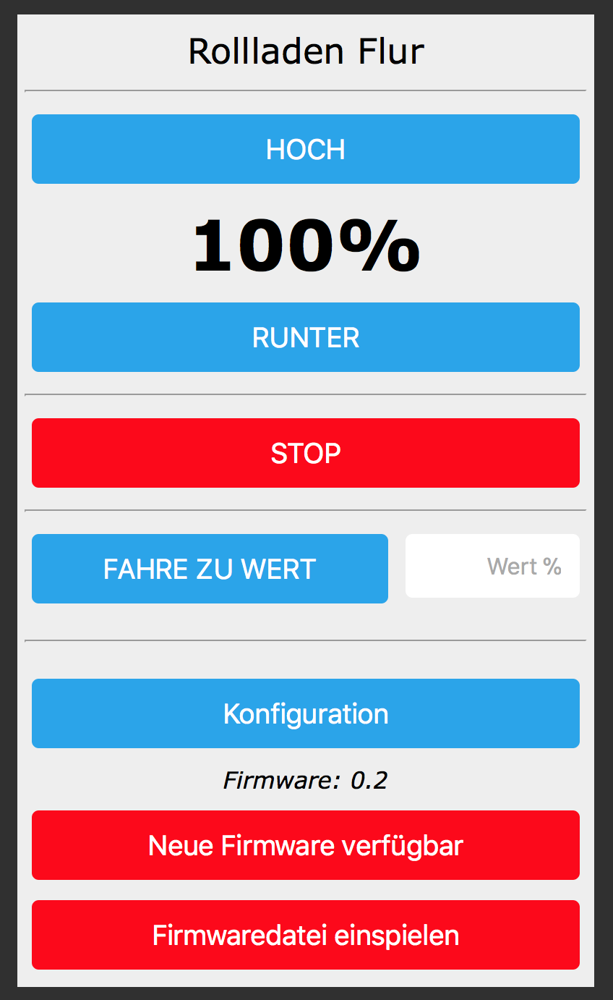

# SonoffDualShutterHMLOX

## Alternative Firmware für Sonoff Dual zur Verwendung als Rollladenaktor

### Hinweis: Die Modifizierung des Sonoff (wenn auch nur softwareseitig) erfolgt auf eigene Gefahr! Während der Arbeiten/des Flash-Vorgangs am geöffneten Gerät darf keine Netzspannung (230V) anliegen!

Für Informationen zur Einrichtung etc., bitte das [Wiki](https://github.com/jp112sdl/SonoffDualShutterHMLOX/wiki) benutzen.

Unterstützung weiterer Modelle:
- eine Firmware für den Sonoff Switch / S20 / Touch / SV / POW gibts [hier](https://github.com/jp112sdl/SonoffHMLOX) 
- eine Firmware für den Sonoff Dual / HVIO (als Schalt-Aktor) gibts [hier](https://github.com/jp112sdl/SonoffDualHVIOHMLOX) 

Die neueste kompilierte Firmware, die direkt auf den Sonoff geflasht werden kann, findet ihr in den [Releases](https://github.com/jp112sdl/SonoffDualShutterHMLOX/releases/latest).

Wenn sich bereits eine ältere Version der hier angebotenen Firmware auf dem Sonoff befindet, kann das Update "Over-the-Air", also direkt über das WLAN erfolgen! -> [Anleitung](https://github.com/jp112sdl/SonoffHMLOX/wiki/Flash_OTA)

Wer "Danke" sagen möchte (in Form einer kleinen Spende), kann gern hier klicken: 

